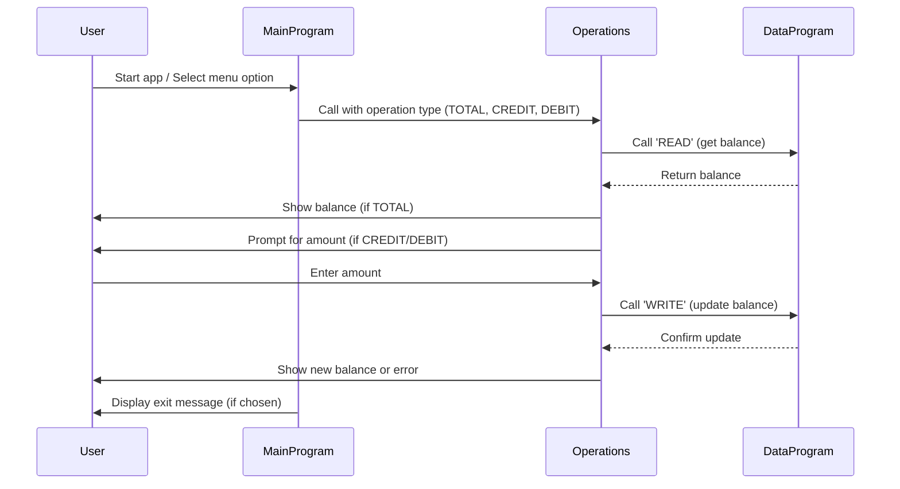

# COBOL Student Account Management System Documentation

This project contains COBOL source files for a simple student account management system. Below is an overview of each COBOL file, their key functions, and business rules related to student accounts.

## Purpose of Each COBOL File

### `main.cob`
**Purpose:**
- Acts as the entry point for the application.
- Presents a menu-driven interface for account management.
- Handles user choices and delegates operations to other programs.

**Key Functions:**
- Displays options: View Balance, Credit Account, Debit Account, Exit.
- Accepts user input and calls the `Operations` program with the selected operation type.

**Business Rules:**
- Only allows valid choices (1-4).
- Exits the program gracefully when the user selects Exit.

---

### `operations.cob`
**Purpose:**
- Implements the core logic for account operations: viewing balance, crediting, and debiting.
- Interacts with the data storage program to read and update balances.

**Key Functions:**
- Receives operation type from `main.cob`.
- For 'TOTAL ': Reads and displays the current balance.
- For 'CREDIT': Prompts for an amount, adds it to the balance, and updates storage.
- For 'DEBIT ': Prompts for an amount, checks for sufficient funds, subtracts from balance if possible, and updates storage.

**Business Rules:**
- Initial balance is set to 1000.00.
- Credit operation adds the entered amount to the balance.
- Debit operation checks if the balance is sufficient before subtracting; otherwise, displays an error for insufficient funds.

---

### `data.cob`
**Purpose:**
- Manages persistent storage of the account balance.
- Provides read and write operations for the balance.

**Key Functions:**
- For 'READ': Returns the current stored balance.
- For 'WRITE': Updates the stored balance with the new value.

**Business Rules:**
- Initial storage balance is set to 1000.00.
- Only two operations are supported: 'READ' and 'WRITE'.

---

## Student Account Business Rules
- Each student account starts with a balance of 1000.00.
- Students can view their current balance, credit (add) funds, or debit (subtract) funds.
- Debit operations are only allowed if the account has sufficient funds.
- All balance updates are persisted via the `data.cob` program.

---

---

## Sequence Diagram: Data Flow

